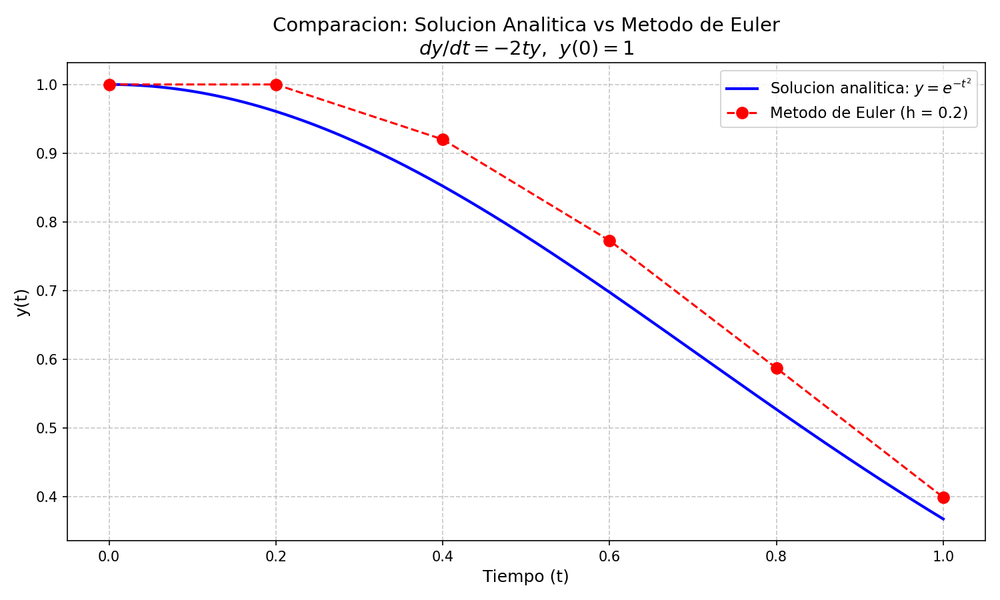

# Comparacion de Soluciones Analiticas vs Numericas

**Autor:** Jehsua Romero Guadarrama

## Descripcion del Problema

Este proyecto resuelve una **ecuacion diferencial ordinaria (EDO) separable** de dos formas distintas y compara los resultados:

1. **Solucion analitica** mediante el metodo de separacion de variables.
2. **Solucion numerica** mediante el metodo de Euler.

### Ecuacion diferencial seleccionada

$$\frac{dy}{dt} = -2ty, \qquad y(0) = 1$$

Una EDO de primer orden, separable, que modela fenomenos de decaimiento como la distribucion gaussiana.

---

## Solucion Analitica (Separacion de Variables)

Separamos las variables *y* y *t* a cada lado de la ecuacion:

$$\frac{1}{y}\,dy = -2t\,dt$$

Integramos ambos lados:

$$\int \frac{1}{y}\,dy = \int -2t\,dt$$

$$\ln|y| = -t^2 + C$$

Aplicamos la funcion exponencial:

$$y = A \cdot e^{-t^2}$$

Con la condicion inicial $y(0) = 1$:

$$1 = A \cdot e^{0} \implies A = 1$$

**Solucion exacta:**

$$\boxed{y(t) = e^{-t^2}}$$

---

## Metodo de Euler (Solucion Numerica)

El metodo de Euler aproxima la solucion avanzando paso a paso con la formula:

$$y_{n+1} = y_n + h \cdot f(t_n,\, y_n)$$

donde $f(t, y) = -2ty$ y el paso es $h = 0.2$ en el intervalo $t \in [0, 1]$.

### Tabla de resultados

| t   | y analitica     | y Euler         | Error absoluto  |
|-----|-----------------|-----------------|-----------------|
| 0.0 | 1.0000000000    | 1.0000000000    | 0.0000000000    |
| 0.2 | 0.9607894392    | 1.0000000000    | 0.0392105608    |
| 0.4 | 0.8521437890    | 0.9200000000    | 0.0678562110    |
| 0.6 | 0.6976763261    | 0.7728000000    | 0.0751236739    |
| 0.8 | 0.5272924240    | 0.5873280000    | 0.0600355760    |
| 1.0 | 0.3678794412    | 0.3993830400    | 0.0315035988    |

---

## Grafica Comparativa

Al ejecutar el programa se genera la siguiente grafica que muestra ambas soluciones superpuestas:



---

## Requisitos

- Python 3.10 o superior
- matplotlib

## Estructura del Proyecto

```
comparar-soluciones-analiticas-vs-numericas/
├── solucion_ecuacion_diferencial.py   # Codigo principal
├── requirements.txt                   # Dependencias
├── grafica_comparativa.png            # Grafica generada (despues de ejecutar)
└── README.md                          # Este archivo
```

## Conclusiones

- La solucion analitica $y(t) = e^{-t^2}$ se obtiene de forma exacta por separacion de variables.
- El metodo de Euler proporciona una aproximacion razonable, pero introduce un error acumulativo que depende del tamano del paso $h$.
- Con $h = 0.2$ el error maximo es de aproximadamente $0.075$, lo cual evidencia la naturaleza de primer orden del metodo.
- Reducir el paso $h$ mejora la precision de la aproximacion a costa de mayor cantidad de iteraciones.
